# DriveHub — Premium Vehicle Rental Management Platform

DriveHub is a state-of-the-art Vehicle Rental Management Platform (VRMP) designed for luxury, efficiency, and a seamless user experience. Built with a modern tech stack and a premium design system, it caters to customers, fleet managers, and administrators alike.

<p align="center">
  
</p>

## ✨ Key Features

- **💎 Premium UI/UX**: Professional design language featuring glassmorphism, elegant typography (Cormorant Garamond & DM Sans), and a sophisticated dark-themed aesthetic.
- **🚗 Extensive Fleet**: Manage and browse traditional cars, electric vehicles, bikes, and vans with ease.
- **📅 Smart Booking System**: Real-time availability tracking, instant booking confirmations, and flexible rental extensions.
- **🛡️ Multi-Role Access**: Dedicated dashboards for:
  - **Customers**: Browse vehicles, track active rentals, and manage profiles.
  - **Fleet Managers**: Monitor active bookings, toggle vehicle availability, and oversee fleet health.
  - **Admins**: Comprehensive system oversight, user management, and fleet editing.
- **💳 Secure Payments**: Integrated payment workflow with clear status tracking and professional confirmation screens.
- **🔐 Robust Security**: JWT-based authentication and secure data handling.

## 🛠️ Tech Stack

### Frontend
- **Framework**: [React](https://reactjs.org/) with [Vite](https://vitejs.dev/)
- **Styling**: Vanilla CSS (Custom Design System)
- **State Management**: React Context & Hooks
- **Icons**: Custom SVG system

### Backend
- **Framework**: [Flask](https://flask.palletsprojects.com/) (Python)
- **Database**: [SQLite](https://www.sqlite.org/) with [SQLAlchemy](https://www.sqlalchemy.org/)
- **Authentication**: JWT (JSON Web Tokens)
- **API Architecture**: RESTful API design

## 🚀 Getting Started

### Prerequisites
- Node.js (v18+)
- Python (v3.9+)

### Installation

1. **Clone the repository**
   ```bash
   git clone https://github.com/bsujalnaik/VEHICLE-RENTAL-MANAGEMENT-PLATFORM.git
   cd VEHICLE-RENTAL-MANAGEMENT-PLATFORM
   ```

2. **Frontend Setup**
   ```bash
   cd Frontend
   npm install
   npm run dev
   ```

3. **Backend Setup**
   ```bash
   cd ../Backend
   python -m venv venv
   source venv/bin/activate  # On Windows: venv\Scripts\activate
   pip install -r requirements.txt
   python seed_premium.py     # To seed the database with premium assets
   python app.py
   ```

## 👥 Contributors

A special thanks to the team that made DriveHub possible:

| Contributor | GitHub Profile |
| :--- | :--- |
| **Aniketh** | [@AnikethBhosale](https://github.com/AnikethBhosale) |
| **Keerthisriniv** | [@Keerthisriniv](https://github.com/Keerthisriniv) |
| **Vishwanath Mathad** | [@Vishwanath2222](https://github.com/Vishwanath2222) |

## 📄 License

This project is part of the HCLTech training program and Hackathon. All rights reserved.
